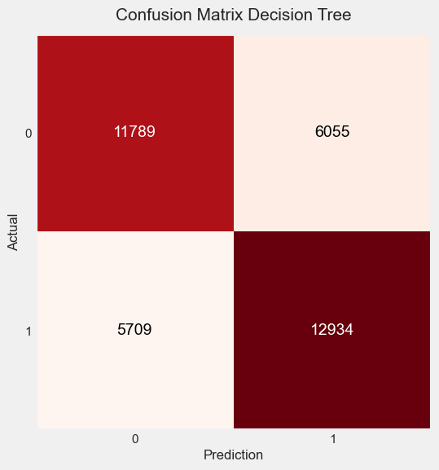

# **Credit Risk Prediction by Building a Machine Learning Model**

## **_Virtual Internship Experience_**

    ID/X Partners – Data Scientist

## **_Author_**

    Althaaf Athaayaa Daffa Qushayyizidane

<br>

## **Background**

<pre style="text-align: justify">
I am involved in a project with a lending company. I will collaborate with various other departments in this project to provide technological solutions for the company. I have been asked to build a model that can predict credit risk using a dataset provided by the company, consisting of data on accepted and rejected loans. Additionally, I also need to prepare visual media to present the solution to the client.<br>

Lending company, or loan company, is a business entity that provides loans to individuals or businesses. This loan company can be a bank, a non-bank financial institution (NBFI), or a fintech company. Loan companies usually provide loans in the form of cash, goods, or services. Cash loans are usually used for various needs, such as buying a house, a vehicle, or working capital. Goods loans are usually used for buying electronic goods, furniture, or vehicles. Service loans are usually used for paying bills, such as electricity or phone bills.
</pre>

<br>
<br>

## **About Dataset**

|            Columns            |                                                                                                     Description                                                                                                     |
| :---------------------------: | :-----------------------------------------------------------------------------------------------------------------------------------------------------------------------------------------------------------------: |
|         `Unnamed: 0`          |                                                                                                                                                                                                                     |
|             `id`              |                                                                                    A unique LC assigned ID for the loan listing.                                                                                    |
|          `member_id`          |                                                                                  A unique LC assigned Id for the borrower member.                                                                                   |
|          `loan_amnt`          |                                                                             The listed amount of the loan applied for by the borrower.                                                                              |
|         `funded_amnt`         |                                                                           The total amount committed to that loan at that point in time.                                                                            |
|       `funded_amnt_inv`       |                                                                                The total amount promised for the loan at that time.                                                                                 |
|            `term`             |                                                                The number of payments on the loan. Values are in months and can be either 36 or 60.                                                                 |
|          `int_rate`           |                                                                                             Interest Rate on the loan.                                                                                              |
|         `installment`         |                                                                          The monthly payment owed by the borrower if the loan originates.                                                                           |
|            `grade`            |                                                                                               LC assigned loan grade.                                                                                               |
|          `sub_grade`          |                                                                                              LC assigned loan subgrade                                                                                              |
|          `emp_title`          |                                                                         The job title supplied by the Borrower when applying for the loan.                                                                          |
|         `emp_length`          |                                          Employment length in years. Possible values are between 0 and 10 where 0 means less than one year and 10 means ten or more years.                                          |
|       `home_ownership`        |                                                 The home ownership status provided by the borrower during registration. Our values are: RENT, OWN, MORTGAGE, OTHER.                                                 |
|         `annual_inc`          |                                                                    The self-reported annual income provided by the borrower during registration.                                                                    |
|     `verification_status`     |                                                                                        Whether the status has been verified.                                                                                        |
|           `issue_d`           |                                                                                        The month which the loan was funded.                                                                                         |
|         `loan_status`         |                                                                                             Current status of the loan.                                                                                             |
|         `pymnt_plan`          |                                                                                                    Payment Plan.                                                                                                    |
|             `url`             |                                                                                       URL for the LC page with listing data.                                                                                        |
|            `desc`             |                                                                                     Loan description provided by the borrower.                                                                                      |
|           `purpose`           |                                                                              A category provided by the borrower for the loan request.                                                                              |
|            `title`            |                                                                                      The loan title provided by the borrower.                                                                                       |
|          `zip_code`           |                                                                The first 3 numbers of the zip code provided by the borrower in the loan application.                                                                |
|         `addr_state`          |                                                                             The state provided by the borrower in the loan application                                                                              |
|             `dti`             |      A ratio calculated using the borrower’s total monthly debt payments on the total debt obligations, excluding mortgage and the requested LC loan, divided by the borrower’s self-reported monthly income.       |
|         `delinq_2yrs`         |                                                    The number of 30+ days past-due incidences of delinquency in the borrower's credit file for the past 2 years.                                                    |
|      `earliest_cr_line`       |                                                                          The date the borrower's earliest reported credit line was opened.                                                                          |
|       `inq_last_6mths`        |                                                                  The number of inquiries in past 6 months (excluding auto and mortgage inquiries)                                                                   |
|   `mths_since_last_delinq`    |                                                                             The number of months since the borrower's last delinquency.                                                                             |
|   `mths_since_last_record`    |                                                                                 The number of months since the last public record.                                                                                  |
|          `open_acc`           |                                                                           The number of open credit lines in the borrower's credit file.                                                                            |
|           `pub_rec`           |                                                                                        Number of derogatory public records.                                                                                         |
|          `revol_bal`          |                                                                                           Total credit revolving balance.                                                                                           |
|         `revol_util`          |                                             Revolving line utilization rate, or the amount of credit the borrower is using relative to all available revolving credit.                                              |
|          `total_acc`          |                                                                      The total number of credit lines currently in the borrower's credit file                                                                       |
|     `initial_list_status`     |                                                                         The initial listing status of the loan. Possible values are – W, F.                                                                         |
|          `out_prncp`          |                                                                              Remaining outstanding principal for total amount funded.                                                                               |
|        `out_prncp_inv`        |                                                                  Remaining outstanding principal for portion of total amount funded by investors.                                                                   |
|         `total_pymnt`         |                                                                                 Payments received to date for total amount funded.                                                                                  |
|       `total_pymnt_inv`       |                                                                     Payments received to date for portion of total amount funded by investors.                                                                      |
|       `total_rec_prncp`       |                                                                                             Principal received to date.                                                                                             |
|        `total_rec_int`        |                                                                                              Interest received to date                                                                                              |
|     `total_rec_late_fee`      |                                                                                             Late fees received to date.                                                                                             |
|         `recoveries`          |                                                                           Indicates if a payment plan has been put in place for the loan.                                                                           |
|   `collection_recovery_fee`   |                                                                                 Recovery cost when receiving a termination notice.                                                                                  |
|        `last_pymnt_d`         |                                                                                          Last month payment was received.                                                                                           |
|       `last_pymnt_amnt`       |                                                                                         Last total payment amount received.                                                                                         |
|        `next_pymnt_d`         |                                                                                            Next scheduled payment date.                                                                                             |
|     `last_credit_pull_d`      |                                                                                    When is the last day LC checks credit history                                                                                    |
| `collections_12_mths_ex_med`  |                                                                          Number of collections in 12 months excluding medical collections.                                                                          |
| `mths_since_last_major_derog` |                                                                                  Months since most recent 90-day or worse rating.                                                                                   |
|         `policy_code`         |                                                                 publicly available policy_code=1, new products not publicly available policy_code=2                                                                 |
|      `application_type`       |                                                        Indicates whether the loan is an individual application or a joint application with two co-borrowers.                                                        |
|      `annual_inc_joint`       |                                                             The combined self-reported annual income provided by the co-borrowers during registration.                                                              |
|          `dti_joint`          | A ratio calculated using the co-borrowers' total monthly payments on the total debt obligations, excluding mortgages and the requested LC loan, divided by the co-borrowers' combined self-reported monthly income. |
|  `verification_status_joint`  |                                                 Indicates if the co-borrowers' joint income was verified by LC, not verified, or if the income source was verified.                                                 |
|       `acc_now_delinq`        |                                                                           The number of accounts on which the borrower is now delinquent.                                                                           |
|        `tot_coll_amt`         |                                                                                         Total collection amounts ever owed.                                                                                         |
|         `tot_cur_bal`         |                                                                                       Total current balance of all accounts.                                                                                        |
|         `open_acc_6m`         |                                                                                       Number of open trades in last 6 months                                                                                        |
|         `open_il_6m`          |                                                                                   Number of currently active installment trades.                                                                                    |
|         `open_il_12m`         |                                                                              Number of installment accounts opened in past 12 months.                                                                               |
|         `open_il_24m`         |                                                                              Number of installment accounts opened in past 24 months.                                                                               |
|     `mths_since_rcnt_il`      |                                                                                Months since most recent installment accounts opened.                                                                                |
|        `total_bal_il`         |                                                                                 Total current balance of all installment accounts.                                                                                  |
|           `il_util`           |                                                                   Ratio of total current balance to high credit/credit limit on all install acct.                                                                   |
|         `open_rv_12m`         |                                                                                Number of revolving trades opened in past 12 months.                                                                                 |
|         `open_rv_24m`         |                                                                              Number of installment accounts opened in past 24 months.                                                                               |
|         `max_bal_bc`          |                                                                               Maximum current balance owed on all revolving accounts.                                                                               |
|          `all_util`           |                                                                                        Balance to credit limit on all trades                                                                                        |
|      `total_rev_hi_lim`       |                                                                                      Total revolving high credit/credit limit                                                                                       |
|           `inq_fi`            |                                                                                        Number of personal finance inquiries.                                                                                        |
|         `total_cu_tl`         |                                                                                              Number of finance trades.                                                                                              |
|        `inq_last_12m`         |                                                                                    Number of credit inquiries in past 12 months                                                                                     |

<br>
<br>
<br>

## **Steps**

- Data Preprocessing
- Exploratory Data Analysis
- Feature Engineering
- Modeling
  <br>
  <br>
  <br>

## **Prerequisite**

- Numpy (1.23.5)
- Pandas (1.5.3)
- Seaborn (0.12.2)
- Matplotlib (3.7.0)
- Scikit-learn (1.2.1)
- Scipy (1.10.0)
- Imbalanced-learn (0.9.1)
  <br>
  <br>
  <br>

# **Getting Started**

## **Import Library**

```sh
# Melakukan import library
import warnings
warnings.filterwarnings('ignore')

import numpy as np
import pandas as pd
import seaborn as sns
from scipy import stats
import matplotlib.pyplot as plt
from matplotlib import rcParams
%matplotlib inline
from sklearn.preprocessing import MinMaxScaler, StandardScaler, RobustScaler
from scipy.stats import boxcox
from imblearn import under_sampling, over_sampling
import gdown
from sklearn.model_selection import train_test_split

from mlxtend.plotting import plot_confusion_matrix
from sklearn.metrics import accuracy_score, precision_score, recall_score, f1_score, roc_auc_score, roc_curve, confusion_matrix, fbeta_score, make_scorer
from sklearn.experimental import enable_halving_search_cv
from sklearn.model_selection import cross_validate, RandomizedSearchCV, GridSearchCV, HalvingGridSearchCV
from sklearn.ensemble import RandomForestClassifier, GradientBoostingClassifier
from sklearn.linear_model import LogisticRegression, Ridge, Lasso, ElasticNet
from sklearn.svm import SVR
from sklearn.neighbors import KNeighborsClassifier
from sklearn.tree import DecisionTreeClassifier
from xgboost import XGBClassifier
from lightgbm import LGBMClassifier, reset_parameter, LGBMClassifier

import shap

from scipy.stats import randint as sp_randint
from scipy.stats import uniform as sp_uniform
```

<br>
<br>
<br>

## Load Data

```sh
df = pd.read_csv('loan_data_2007_2014.csv')
df.head(5)
```


<br>
<br>
<br>

## **DATA PREPROCESSING**

### CLEANING

```sh
df_preprocess = df.copy() = dataframe_ori.copy()
```

```sh
df_preprocess = df.copy().info(verbose=True, show_counts=True)
```

```sh
<class 'pandas.core.frame.DataFrame'>
RangeIndex: 466285 entries, 0 to 466284
Data columns (total 75 columns):
 #   Column                       Non-Null Count   Dtype
---  ------                       --------------   -----
 0   Unnamed: 0                   466285 non-null  int64
 1   id                           466285 non-null  int64
 2   member_id                    466285 non-null  int64
 3   loan_amnt                    466285 non-null  int64
 4   funded_amnt                  466285 non-null  int64
 5   funded_amnt_inv              466285 non-null  float64
 6   term                         466285 non-null  object
 7   int_rate                     466285 non-null  float64
 8   installment                  466285 non-null  float64
 9   grade                        466285 non-null  object
 10  sub_grade                    466285 non-null  object
 11  emp_title                    438697 non-null  object
 12  emp_length                   445277 non-null  object
 13  home_ownership               466285 non-null  object
 14  annual_inc                   466281 non-null  float64
 15  verification_status          466285 non-null  object
 16  issue_d                      466285 non-null  object
 17  loan_status                  466285 non-null  object
 18  pymnt_plan                   466285 non-null  object
 19  url                          466285 non-null  object
 20  desc                         125981 non-null  object
 21  purpose                      466285 non-null  object
 22  title                        466264 non-null  object
 23  zip_code                     466285 non-null  object
 24  addr_state                   466285 non-null  object
 25  dti                          466285 non-null  float64
 26  delinq_2yrs                  466256 non-null  float64
 27  earliest_cr_line             466256 non-null  object
 28  inq_last_6mths               466256 non-null  float64
 29  mths_since_last_delinq       215934 non-null  float64
 30  mths_since_last_record       62638 non-null   float64
 31  open_acc                     466256 non-null  float64
 32  pub_rec                      466256 non-null  float64
 33  revol_bal                    466285 non-null  int64
 34  revol_util                   465945 non-null  float64
 35  total_acc                    466256 non-null  float64
 36  initial_list_status          466285 non-null  object
 37  out_prncp                    466285 non-null  float64
 38  out_prncp_inv                466285 non-null  float64
 39  total_pymnt                  466285 non-null  float64
 40  total_pymnt_inv              466285 non-null  float64
 41  total_rec_prncp              466285 non-null  float64
 42  total_rec_int                466285 non-null  float64
 43  total_rec_late_fee           466285 non-null  float64
 44  recoveries                   466285 non-null  float64
 45  collection_recovery_fee      466285 non-null  float64
 46  last_pymnt_d                 465909 non-null  object
 47  last_pymnt_amnt              466285 non-null  float64
 48  next_pymnt_d                 239071 non-null  object
 49  last_credit_pull_d           466243 non-null  object
 50  collections_12_mths_ex_med   466140 non-null  float64
 51  mths_since_last_major_derog  98974 non-null   float64
 52  policy_code                  466285 non-null  int64
 53  application_type             466285 non-null  object
 54  annual_inc_joint             0 non-null       float64
 55  dti_joint                    0 non-null       float64
 56  verification_status_joint    0 non-null       float64
 57  acc_now_delinq               466256 non-null  float64
 58  tot_coll_amt                 396009 non-null  float64
 59  tot_cur_bal                  396009 non-null  float64
 60  open_acc_6m                  0 non-null       float64
 61  open_il_6m                   0 non-null       float64
 62  open_il_12m                  0 non-null       float64
 63  open_il_24m                  0 non-null       float64
 64  mths_since_rcnt_il           0 non-null       float64
 65  total_bal_il                 0 non-null       float64
 66  il_util                      0 non-null       float64
 67  open_rv_12m                  0 non-null       float64
 68  open_rv_24m                  0 non-null       float64
 69  max_bal_bc                   0 non-null       float64
 70  all_util                     0 non-null       float64
 71  total_rev_hi_lim             396009 non-null  float64
 72  inq_fi                       0 non-null       float64
 73  total_cu_tl                  0 non-null       float64
 74  inq_last_12m                 0 non-null       float64
dtypes: float64(46), int64(7), object(22)
memory usage: 266.8+ MB
```

#### - Terdapat **75** kolom dan **466285** baris.

#### - Terdapat beberapa kolom yang mempunyai null value yang akan dilakukan penghapusan atau imputasi.

<br>
<br>
<br>

### Checking Duplicate Value

```sh
dataframe_preprocess.duplicated().sum()


0
```

#### Secara keseluruhan, **tidak terdapat data duplikat** pada dataset

<br>
<br>
<br>

### Drop Unnecessary Columns

|                                                                                                                                                                                                                                        Drop Features                                                                                                                                                                                                                                        |                                   Reasons                                   |
| :-----------------------------------------------------------------------------------------------------------------------------------------------------------------------------------------------------------------------------------------------------------------------------------------------------------------------------------------------------------------------------------------------------------------------------------------------------------------------------------------: | :-------------------------------------------------------------------------: |
|                                                                                                                                                                                                                           `Unnamed : 0`, `member_id`, `id`, `url`                                                                                                                                                                                                                           |                          Columns have unique value                          |
| `funded_amnt_inv`, `installment`, `sub_grade`, `issue_d`, `title`, `zip_code`, `addr_state`, `delinq_2yrs`, `earliest_cr_line`, `inq_last_6mths`, `revol_bal`, `revol_util`, `out_prncp`, `out_prncp_inv`, `total_pymnt`, `total_pymnt_inv`, `total_rec_prncp`, `total_rec_int`, `total_rec_late_fee`,`recoveries`, `collection_recovery_fee`, `last_pymnt_d`, `last_pymnt_amnt`, `last_credit_pull_d`, `collections_12_mths_ex_med`, `policy_code`, `open_acc`,`next_pymnt_d`,`pymnt_plan` | Features are not so important for carrying out the credit granting process. |

<br>
<br>
<br>

### Define Target Variable/Labeling

Dalam project credit risk modeling, tujuan utama adalah untuk melakukan prediksi terhadap suatu individu akan kemampuan mereka untuk melakukan pembayaran terhadap pinjaman/kredit yang diberikan. Oleh karena itu, variabel target yang digunakan harus mencerminkan kemampuan individu dalam hal tersebut.

Dalam dataset ini, variabel `loan_status` adalah variabel yang dapat dijadikan variabel target karena mencerminkan performa masing-masing individu dalam melakukan pembayaran terhadap pinjaman/kredit selama ini.

```sh
df_preprocess.loan_status.value_counts(normalize=True)*100
```

#### Dapat dilihat bahwa variabel `loan_status` memiliki beberapa nilai:

#### `Current` artinya pembayaran lancar; `Charged Off` artinya pembayaran macet sehingga dihapusbukukan; `Late` artinya pembayaran telat dilakukan; `In Grace Period` artinya dalam masa tenggang; `Fully Paid` artinya pembayaran lunas; `Default` artinya pembayaran macet.

#### Dari definisi-definisi tersebut, masing-masing individu dapat ditandai apakah mereka merupakan `bad loan` (peminjam yang buruk) atau `good loan` (peminjam yang baik)

#### Definisi bad dan good loan terkadang bisa berbeda tergantung dari kebutuhan bisnis. Pada contoh ini, saya menggunakan keterlambatan pembayaran di atas 30 hari dan yang lebih buruk dari itu sebagai penanda bad loan.

```sh
bad_status = [
    'Charged Off'
    , 'Default'
    , 'Does not meet the credit policy. Status:Charged Off'
    , 'Late (31-120 days)'
]

df_preprocess['bad_flag'] = np.where(df_preprocess['loan_status'].isin(bad_status), 1, 0)
```

```sh
df_preprocess.drop('loan_status', axis=1, inplace=True)
```

### Checking and Handling Missing Value

```sh
# Mengecek missing value ditiap fitur
missing_values_count = df_preprocess.isnull().sum()
missing_values_count
```

```sh
loan_amnt                           0
funded_amnt                         0
term                                0
int_rate                            0
grade                               0
emp_length                      21008
home_ownership                      0
annual_inc                          4
verification_status                 0
loan_status                         0
desc                           340304
purpose                             0
dti                                 0
mths_since_last_delinq         250351
mths_since_last_record         403647
pub_rec                            29
total_acc                          29
initial_list_status                 0
mths_since_last_major_derog    367311
application_type                    0
annual_inc_joint               466285
dti_joint                      466285
verification_status_joint      466285
acc_now_delinq                     29
tot_coll_amt                    70276
tot_cur_bal                     70276
open_acc_6m                    466285
open_il_6m                     466285
open_il_12m                    466285
open_il_24m                    466285
mths_since_rcnt_il             466285
total_bal_il                   466285
il_util                        466285
open_rv_12m                    466285
open_rv_24m                    466285
max_bal_bc                     466285
all_util                       466285
total_rev_hi_lim                70276
inq_fi                         466285
total_cu_tl                    466285
inq_last_12m                   466285
dtype: int64
```


#### Terdapat banyak sekali data yang hilang pada dataset. Ada **20 kolom** pada dataset yang >70% tidak memiliki data didalamnya dan akan dilakukan penghapusan kolom. Lalu akan dilakukan **penghapusan** atau **imputasi** pada kolom yang memiliki missing value **<10%**.

```sh
features = list(missing_value['feature'][missing_value['percentage'] > 70])
features
```

```sh
for feature in features:
  df_preprocess = df_preprocess.drop(columns=feature) #Penghapusan kolom yg memiliki missing value >70%
```

#### Imputasi

```sh
# Replace missing values with 0 in column: 'total_rev_hi_lim'
df_preprocess = df_preprocess.fillna({'total_rev_hi_lim': 0})
# Replace missing values with 0 in column: 'tot_cur_bal'
df_preprocess = df_preprocess.fillna({'tot_cur_bal': 0})
# Replace missing values with 0 in column: 'tot_coll_amt'
df_preprocess = df_preprocess.fillna({'tot_coll_amt': 0})
# Replace missing values with "Other" in column: 'next_pymnt_d'
df_preprocess = df_preprocess.fillna({'next_pymnt_d': "Other"})
# Replace missing values with 0 in column: 'mths_since_last_delinq'
df_preprocess = df_preprocess.fillna({'mths_since_last_delinq': 0})
# Drop rows with missing data in column: 'annual_inc'
df_preprocess = df_preprocess.dropna(subset=['annual_inc'])
df_preprocess = df_preprocess.dropna(subset=['emp_length'])
df_preprocess = df_preprocess.dropna(subset=['acc_now_delinq'])
df_preprocess = df_preprocess.dropna(subset=['pub_rec'])
df_preprocess = df_preprocess.dropna(subset=['total_acc'])
```

<br>
<br>
<br>

### Feature Extraction

```sh
# Rename column 'term' to 'term_month'
df_preprocess = df_preprocess.rename(columns={'term': 'term_month'})

# Replace all instances of "months" with "" in column: 'term_month'
df_preprocess['term_month'] = df_preprocess['term_month'].str.replace("months", "", case=False, regex=False)

# Change column type to int64 for column: 'annual_inc'
df_preprocess = df_preprocess.astype({'annual_inc': 'int64'})
```

```sh
for item in df_preprocess['grade'].unique():
  if item in ['A', 'B', 'C']:
    # No change needed for these specific values
    pass
  else:
    df_preprocess.loc[df_preprocess['grade'] == item, 'grade'] = "Other"
```

```sh
for item in df_preprocess['home_ownership'].unique():
  if item in ['MORTGAGE', 'RENT', 'OWN']:
    # No change needed for these specific values
    pass
  else:
    df_preprocess.loc[df_preprocess['home_ownership'] == item, 'home_ownership'] = "Other"
```

```sh
#verification_status
df_preprocess['verification_status'] = df_preprocess['verification_status'].replace(['Source Verified'],'Verified')
```

```sh
#loan_status
df_preprocess['loan_status'] = df_preprocess['loan_status'].replace(['Does not meet the credit policy. Status:Fully Paid'],'Fully Paid')
df_preprocess['loan_status'] = df_preprocess['loan_status'].replace(['Does not meet the credit policy. Status:Charged Off'],'Charged Off')
df_preprocess['loan_status'] = df_preprocess['loan_status'].replace(['Late (16-30 days)','Late (31-120 days)'],'Late')
```

```sh
#emp_length
df_preprocess['emp_length'] = df_preprocess['emp_length'].replace(['< 1 year', '1 year', '2 years', '3 years', '4 years', '5 years'],'0-5 years')
df_preprocess['emp_length'] = df_preprocess['emp_length'].replace(['6 years', '7 years', '8 years', '9 years'],'6-9 years')
```

```sh
# pub_rec
df_preprocess['pub_rec'] = df_preprocess['pub_rec'].replace([0.0],'None')
df_preprocess['pub_rec'] = df_preprocess['pub_rec'].replace([1.0, 2.0, 3.0, 4.0, 5.0],'1-5')
df_preprocess['pub_rec'] = df_preprocess['pub_rec'].replace([6.0, 7.0, 8.0, 9.0, 10.0],'6-10')
df_preprocess['pub_rec'] = df_preprocess['pub_rec'].replace([11.0, 12.0, 13.0, 14.0, 15.0, 16.0, 17.0, 18.0, 19.0, 21.0, 34.0, 40.0, 49.0, 54.0, 63.0],'>10')
```

<br>
<br>
<br>

## **EXPLORATORY DATA ANALYSIS**

### Group Columns by Type

```sh
# Pengelompokan kolom berdasarkan jenisnya
nums = ['int64', 'int32', 'int16', 'float64', 'float32', 'float16']
nums = df_preprocess.select_dtypes(include=nums)
nums = nums.columns

cats = ['object','bool']
cats = df_preprocess.select_dtypes(include=cats)
cats = cats.columns
```

<br>
<br>
<br>

### Univariate Analysis


**`loan_amnt`** : Jumlah pinjaman yang diajukan oleh peminjam (Memiliki distribusi cenderung **_Right Skewd_**)<br>

**`funded_amnt`** : Jumlah total yang berkomitmen untuk pinjaman tersebut pada saat itu. (Memiliki distribusi cenderung **_Right Skewd_**)<br>

**`int_rate`** : Tingkat bunga yang dikenakan pada pinjaman. (Memiliki distribusi cenderung **_Normal_**)<br>

**`annual_inc`** : Pendapatan tahunan yang dilaporkan sendiri oleh peminjam saat pendaftaran. (Memilki distribusi cenderung **_Right Skewd_**)<br>

**`dti`** : Rasio yang dihitung dengan menggunakan total pembayaran utang bulanan peminjam terhadap total kewajiban utang (Memilki distribusi**_Normal_**)<br>

**`mths_since_last_delinq`** : Jumlah bulan sejak tunggakan terakhir peminjam.<br>

**`total_acc`** : Jumlah total lini kredit yang saat ini ada di file kredit peminjam.<br>

**`tot_coll_amt`** : Jumlah total piutang yang pernah ditagih.<br>

**`tot_cur_bal`** : Total saldo saat ini dari semua rekening.<br>

**`total_rev_hi_lim`** : Total kredit bergulir tinggi/pagu kredit.<br>

**`acc_now_delinq`** : Jumlah akun yang mengalami tunggakan. Banyak nasabah yang tidak menunggak, namun ada beberapa yang menunggak.
<br>

<br>


<br>
<br>
<br>

### Multivariate Analysis


#### `funded_amnt` & `loan_amnt` memiliki korelasi yang sangat kuat. Ini berarti bahwa nasabah berkomitmen dengan jumlah pinjaman yang mereka ajukan. Namun salah satu akan dihapus karna dapat menyebabkan redundan.

#### `annual_inc` & `loan_amnt` juga memiliki korelasi yang positif, ini berarti bahwa pendapatan tahunan mempengaruhi jumlah pinjaman yang diajukan.

```sh
corr_matrix = df_preprocess[nums].corr().abs()
upper = corr_matrix.where(np.triu(np.ones(corr_matrix.shape), k=1).astype(np.bool_))
to_drop_hicorr = [column for column in upper.columns if any(upper[column] > 0.7)]
```

```sh
to_drop_hicorr
```

```sh
df_preprocess.drop(to_drop_hicorr, axis=1, inplace=True)
```

<br>
<br>
<br>

## **FEATURE ENGINEERING**

```sh
df_fe = df_preprocess.copy()
```

### Feature Encoding

```sh
# Change column type to int64 for column: 'term_months'
df_fe = df_fe.astype({'term_month': 'int64'})
```

```sh
mapping_grade = {'A' : 1,
                 'B' : 2,
                 'C' : 3,
                 'Other' : 4}

df_fe['grade'] = df_fe['grade'].map(mapping_grade)
```

```sh
mapping_grade2 = {'0-5 years' : 1,
                 '6-9 years' : 2,
                 '10+ years' : 3}

df_fe['emp_length'] = df_fe['emp_length'].map(mapping_grade2)
```

```sh
mapping_grade3 = {'None' : 0,
                 '1-5' : 1,
                 '6-10' : 2,
                 '>10' : 3}

df_fe['pub_rec'] = df_fe['pub_rec'].map(mapping_grade3)
```

```sh

df_fe['verification_status'] = df_fe['verification_status'].astype('category').cat.codes
df_fe['home_ownership'] = df_fe['home_ownership'].astype('category').cat.codes
df_fe['loan_status'] = df_fe['loan_status'].astype('category').cat.codes
df_fe['purpose'] = df_fe['purpose'].astype('category').cat.codes
```

<br>

### New Features

```sh
df_fe['monthly_payment'] = df_fe['loan_amnt'] / df_fe['term_month'] #Rasio Angsuran per Bulan
df_fe['total_cost'] = df_fe['loan_amnt'] * (1 + df_fe['int_rate']) #Total Biaya Pinjaman
df_fe['season'] = df_fe['term_month'] % 12 #Musim Pinjaman
df_fe['yearly_loan'] = df_fe['loan_amnt'] / (df_fe['term_month'] / 12)
#df_fe['risk_indicator'] = df_fe['monthly_payment'] / df_fe['annual_income'] / df_fe['credit_score']
```

<br>
<br>
<br>

### Class Imbalance

```sh
# Melihat berapa dejarat ketimpangan pada class

for i in range(len(df_fe['bad_flag'].value_counts())):
    a = round(df_fe['bad_flag'].value_counts()[i]/df_fe.shape[0]*100,2)
    print(f'{a}%')

print('Degree of Imbalance dari data ini termasuk pada Moderate Imbalance')
```

```sh
# Membuat kolom baru untuk melihat Class 'Yes'

df_fe['Target_class'] = df_fe['bad_flag']==1
df_fe['Target_class'].value_counts()
```

```sh
# Memisahkan dataframe tanpa Response dan Res_class dan hanya Res_class
X = df_fe[[col for col in df_fe.columns if (str(df_fe[col].dtype) != 'object') and col not in ['bad_flag', 'Target_class']]]
y = df_fe['Target_class'].values
print(X.shape)
print(y.shape)
```

```sh
X_over_SMOTE, y_over_SMOTE = over_sampling.SMOTE(sampling_strategy=0.3, random_state=77).fit_resample(X, y) # type: ignore
```

```sh
pd.Series(y_over_SMOTE).value_counts()
```

```sh
X_over_SMOTE['bad_flag'] = y_over_SMOTE.astype(int)
df_fe = X_over_SMOTE.copy()
```

```sh
# Memisahkan dataframe tanpa Response dan Res_class dan hanya Res_class
df_fe['Target_class'] = df_fe['bad_flag']==1
df_fe['Target_class'].value_counts()
X2 = df_fe[[col for col in df_fe.columns if (str(df_fe[col].dtype) != 'object') and col not in ['bad_flag', 'Target_class']]]
y2 = df_fe['Target_class'].values
print(X2.shape)
print(y2.shape)
```

```sh
X_under, y_under = under_sampling.RandomUnderSampler(sampling_strategy=1, random_state=77).fit_resample(X2, y2)
```

```sh
print('Original')
print(pd.Series(y).value_counts())
print('\n')
print('OVERSAMPLING SMOTE & UNDERSAMPLING')
print('')
print(pd.Series(y_under).value_counts())
```

```sh
X_under['bad_flag'] = y_under.astype(int)
df_fe = X_under.copy()
```

### Handling Outliers

```sh
outliers = ['mths_since_last_delinq','tot_coll_amt','tot_cur_bal','total_rev_hi_lim','total_acc']
```

```sh
print(f'Jumlah baris sebelum memfilter outlier: {len(df_fe)}')

cleaning_outliers = np.array([True] * len(df_fe))
for col in outliers:
    Q1 = df_fe[col].quantile(0.25)
    Q3 = df_fe[col].quantile(0.75)
    IQR = Q3 - Q1
    low_limit = Q1 - (IQR * 1.5)
    high_limit = Q3 + (IQR * 1.5)

    cleaning_outliers = ((df_fe[col] >= low_limit) & (df_fe[col] <= high_limit)) & cleaning_outliers

df_fe = df_fe[cleaning_outliers]

print(f'Jumlah baris setelah memfilter outlier: {len(df_fe)}')
```

## **MODELING**

```sh
df_model = df_fe.copy()
```

```sh
drop_columns2 = ['season','yearly_loan','acc_now_delinq','bad_flag','grade','tot_coll_amt','emp_length','home_ownership']
```

```sh
from sklearn.model_selection import train_test_split

# Pisahkan fitur dan target
X = df_model.drop(drop_columns2, axis=1)
y = df_model['bad_flag']

# Bagi data menjadi train dan test
X_train, X_test, y_train, y_test = train_test_split(X, y, test_size=0.2, random_state=77)
```

```sh
def eval_classification(model):
    y_pred = model.predict(X_test.values)
    y_pred_train = model.predict(X_train.values)
    y_pred_proba = model.predict_proba(X_test.values)
    y_pred_proba_train = model.predict_proba(X_train.values)

    print("Accuracy (Test Set): %.2f" % accuracy_score(y_test, y_pred))
    print("Accuracy (Train Set): %.2f" % accuracy_score(y_train, y_pred_train))
    print("Precision (Test Set): %.2f" % precision_score(y_test, y_pred))
    print("Precision (Train Set): %.2f" % precision_score(y_train, y_pred_train))
    print("Recall (Test Set): %.2f" % recall_score(y_test, y_pred))
    print("Recall (Train Set): %.2f" % recall_score(y_train, y_pred_train))
    print("F1-Score (Test Set): %.2f" % f1_score(y_test, y_pred))
    print("F1-Score (Train Set): %.2f" % f1_score(y_train, y_pred_train))

    print("roc_auc (test-proba): %.2f" % roc_auc_score(y_test, y_pred_proba[:, 1]))
    print("roc_auc (train-proba): %.2f" % roc_auc_score(y_train, y_pred_proba_train[:, 1]))

    score = cross_validate(RandomForestClassifier(), X, y, cv=5, scoring='roc_auc', return_train_score=True)
    print('roc_auc (crossval train): '+ str(score['train_score'].mean()))
    print('roc_auc (crossval test): '+ str(score['test_score'].mean()))

def show_feature_importance(model):
    feat_importances = pd.Series(model.feature_importances_, index=X.columns)
    ax = feat_importances.nlargest(25).plot(kind='barh', figsize=(10, 8))
    ax.invert_yaxis()

    plt.xlabel('score')
    plt.ylabel('feature')
    plt.title('feature importance score')

def show_best_hyperparameter(model):
    print(model.best_estimator_.get_params())

lg = LogisticRegression(random_state=77)
knn = KNeighborsClassifier()
dt = DecisionTreeClassifier(random_state=77)
xgb = XGBClassifier(random_state=77)
rf = RandomForestClassifier(random_state=77)
lgb = LGBMClassifier(random_state=77)
grd = GradientBoostingClassifier(random_state=77)
```

<br>
<br>
<br>

### Logistic Regression

```sh
Accuracy (Test Set): 0.62
Accuracy (Train Set): 0.62
Precision (Test Set): 0.65
Precision (Train Set): 0.64
Recall (Test Set): 0.58
Recall (Train Set): 0.57
F1-Score (Test Set): 0.61
F1-Score (Train Set): 0.60
roc_auc (test-proba): 0.67
roc_auc (train-proba): 0.67
roc_auc (crossval train): 1.0
roc_auc (crossval test): 0.8228688563676686
```


### Hyperparameter Tuning

```sh
Fitting 5 folds for each of 300 candidates, totalling 1500 fits
Accuracy (Test Set): 0.62
Accuracy (Train Set): 0.62
Precision (Test Set): 0.65
Precision (Train Set): 0.64
Recall (Test Set): 0.58
Recall (Train Set): 0.57
F1-Score (Test Set): 0.61
F1-Score (Train Set): 0.60
roc_auc (test-proba): 0.67
roc_auc (train-proba): 0.67
roc_auc (crossval train): 1.0
roc_auc (crossval test): 0.8232243337746656
```

<br>
<br>
<br>

### K-Nearest Neighbor

```sh
Accuracy (Test Set): 0.69
Accuracy (Train Set): 0.80
Precision (Test Set): 0.66
Precision (Train Set): 0.76
Recall (Test Set): 0.80
Recall (Train Set): 0.90
F1-Score (Test Set): 0.73
F1-Score (Train Set): 0.82
roc_auc (test-proba): 0.76
roc_auc (train-proba): 0.90
roc_auc (crossval train): 0.9999999999812156
roc_auc (crossval test): 0.8235479800351577
```


### Hyperparameter Tuning

```sh
Accuracy (Test Set): 0.76
Accuracy (Train Set): 1.00
Precision (Test Set): 0.72
Precision (Train Set): 1.00
Recall (Test Set): 0.87
Recall (Train Set): 1.00
F1-Score (Test Set): 0.79
F1-Score (Train Set): 1.00
roc_auc (test-proba): 0.76
roc_auc (train-proba): 1.00
roc_auc (crossval train): 0.9999999998872932
roc_auc (crossval test): 0.8227373123341438
```

<br>
<br>
<br>

### Decision Tree

```sh
Accuracy (Test Set): 0.68
Accuracy (Train Set): 1.00
Precision (Test Set): 0.68
Precision (Train Set): 1.00
Recall (Test Set): 0.69
Recall (Train Set): 1.00
F1-Score (Test Set): 0.69
F1-Score (Train Set): 1.00
roc_auc (test-proba): 0.68
roc_auc (train-proba): 1.00
roc_auc (crossval train): 1.0
roc_auc (crossval test): 0.822479036102307
```





### Hyperparameter Tuning

```sh
Accuracy (Test Set): 0.68
Accuracy (Train Set): 0.75
Precision (Test Set): 0.70
Precision (Train Set): 0.77
Recall (Test Set): 0.66
Recall (Train Set): 0.73
F1-Score (Test Set): 0.68
F1-Score (Train Set): 0.75
roc_auc (test-proba): 0.75
roc_auc (train-proba): 0.84
roc_auc (crossval train): 1.0
roc_auc (crossval test): 0.8228761474551405
```

<br>
<br>
<br>

### Random Forest

```sh
Accuracy (Test Set): 0.76
Accuracy (Train Set): 1.00
Precision (Test Set): 0.77
Precision (Train Set): 1.00
Recall (Test Set): 0.74
Recall (Train Set): 1.00
F1-Score (Test Set): 0.76
F1-Score (Train Set): 1.00
roc_auc (test-proba): 0.84
roc_auc (train-proba): 1.00
roc_auc (crossval train): 1.0
roc_auc (crossval test): 0.8225740249152558
```


### Hyperparameter Tuning

```sh
Accuracy (Test Set): 0.74
Accuracy (Train Set): 0.95
Precision (Test Set): 0.76
Precision (Train Set): 0.97
Recall (Test Set): 0.73
Recall (Train Set): 0.94
F1-Score (Test Set): 0.74
F1-Score (Train Set): 0.95
roc_auc (test-proba): 0.83
roc_auc (train-proba): 0.99
roc_auc (crossval train): 1.0
roc_auc (crossval test): 0.8225153851443097
```

<br>
<br>
<br>

### XGBoost

```sh
Accuracy (Test Set): 0.77
Accuracy (Train Set): 0.80
Precision (Test Set): 0.81
Precision (Train Set): 0.84
Recall (Test Set): 0.71
Recall (Train Set): 0.73
F1-Score (Test Set): 0.76
F1-Score (Train Set): 0.78
roc_auc (test-proba): 0.85
roc_auc (train-proba): 0.88
roc_auc (crossval train): 1.0
roc_auc (crossval test): 0.8226904145231032
```


### Hyperparameter Tuning

```sh
Accuracy (Test Set): 0.77
Accuracy (Train Set): 0.78
Precision (Test Set): 0.82
Precision (Train Set): 0.84
Recall (Test Set): 0.71
Recall (Train Set): 0.71
F1-Score (Test Set): 0.76
F1-Score (Train Set): 0.77
roc_auc (test-proba): 0.85
roc_auc (train-proba): 0.87
roc_auc (crossval train): 1.0
roc_auc (crossval test): 0.8218795580755239
```

<br>
<br>
<br>

### LightGBM

```sh
Accuracy (Test Set): 0.78
Accuracy (Train Set): 0.78
Precision (Test Set): 0.83
Precision (Train Set): 0.84
Recall (Test Set): 0.71
Recall (Train Set): 0.71
F1-Score (Test Set): 0.77
F1-Score (Train Set): 0.77
roc_auc (test-proba): 0.86
roc_auc (train-proba): 0.86
roc_auc (crossval train): 1.0
roc_auc (crossval test): 0.8229375835605541
```


### Hyperparameter Tuning

```sh
Accuracy (Test Set): 0.76
Accuracy (Train Set): 0.76
Precision (Test Set): 0.78
Precision (Train Set): 0.78
Recall (Test Set): 0.73
Recall (Train Set): 0.73
F1-Score (Test Set): 0.76
F1-Score (Train Set): 0.75
roc_auc (test-proba): 0.85
roc_auc (train-proba): 0.85
roc_auc (crossval train): 1.0
roc_auc (crossval test): 0.8230245115727282
```

<br>
<br>
<br>

### Gradient Boost

```sh
Accuracy (Test Set): 0.71
Accuracy (Train Set): 0.71
Precision (Test Set): 0.71
Precision (Train Set): 0.71
Recall (Test Set): 0.73
Recall (Train Set): 0.73
F1-Score (Test Set): 0.72
F1-Score (Train Set): 0.72
roc_auc (test-proba): 0.80
roc_auc (train-proba): 0.80
roc_auc (crossval train): 1.0
roc_auc (crossval test): 0.8221607859498355
```


### Hyperparameter Tuning

```sh
Accuracy (Test Set): 0.79
Accuracy (Train Set): 0.86
Precision (Test Set): 0.86
Precision (Train Set): 0.94
Recall (Test Set): 0.70
Recall (Train Set): 0.78
F1-Score (Test Set): 0.77
F1-Score (Train Set): 0.85
roc_auc (test-proba): 0.87
roc_auc (train-proba): 0.94
roc_auc (crossval train): 1.0
roc_auc (crossval test): 0.8224397031814791
```

<br>
<br>
<br>

# **CONCLUSION**

#### Model yang dipilih adalah model `Gradient Boost` yang sudah di tuning parameternya. Metrix utama yang digunakan adalah `ROC-AUC` yang dimana menunjukkan seberapa baik model membedakan antara kelas. Nilai AUC yang tinggi menunjukkan bahwa model memiliki kemampuan yang baik untuk membedakan antara peminjam yang berisiko dan yang tidak, serta `Precision` yang dimana kita tidak ingin **False Positive** tinggi atau mengurangi **False Positive** sekecil-kecilnya.<br>

#### Dalam konteks lending company, **False Positive** berarti menyetujui pinjaman yang seharusnya ditolak, False Positive dapat menyebabkan kerugian finansial bagi perusahaan.<br>

<br>
<br>
<br>

# **THE BEST FIT MODEL**

## **Gradient Boost Model**

Model ini memiliki nilai `Precision` yang tinggi pada kedua data latihan **(0.90)** dan data uji **(0.88)** menunjukkan bahwa model cukup handal dalam memprediksi kelas positif, yang penting dalam konteks credit scoring untuk meminimalkan risiko kredit macet. Serta nilai `ROC-AUC` yang tinggi untuk probabilitas pada data latihan **(0.88)** dan data uji **(0.87)** menunjukkan bahwa model memiliki kemampuan yang baik dalam membedakan antara kelas positif dan negatif. Model tidak overfit maupun underfit yang dapat disebut sebagai model **_best fit_**.<br>


# **Business Recomendations**

#### - Competitive Interest Rate Offer : Offer lower interest rates than competitors to attract customers with a good risk profile (low int_rate).

#### - Conduct regular monitoring and credit collection to minimize the risk of bad debts.

#### - Offer loan products with various ceilings to meet the needs of customers with different risk profiles.

#### - Targeting High Income Customers: Focus on marketing credit products to customers with high annual income levels.
